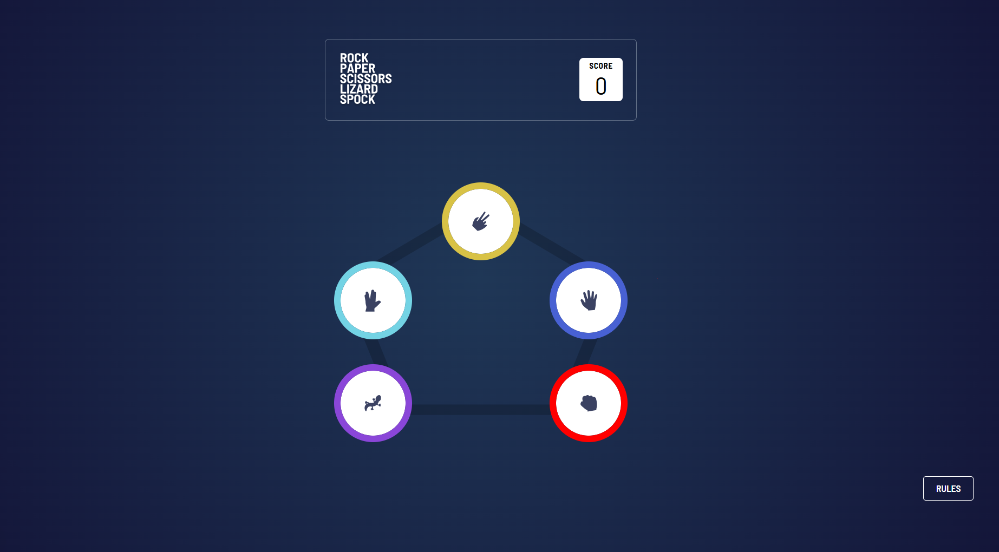

# Frontend Mentor - Rock, Paper, Scissors solution

This is a solution to the [Rock, Paper, Scissors challenge on Frontend Mentor](https://www.frontendmentor.io/challenges/rock-paper-scissors-game-pTgwgvgH). Frontend Mentor challenges help you improve your coding skills by building realistic projects.

- [Overview](#overview)
  - [The challenge](#the-challenge)
  - [Screenshot](#screenshot)
  - [Links](#links)
- [My process](#my-process)
  - [Built with](#built-with)
  - [What I learned](#what-i-learned)
- [Author](#author)
- [Acknowledgments](#acknowledgments)

## Overview

### The challenge

Users should be able to:

- View the optimal layout for the game depending on their device's screen size
- Play Rock, Paper, Scissors against the computer
- Maintain the state of the score after refreshing the browser _(optional)_
- **Bonus**: Play Rock, Paper, Scissors, Lizard, Spock against the computer _(optional)_

### Screenshot

### Links

- Solution URL: https://github.com/Fanu-Cd/frontend-mentor-rock-paper-scissors-game
- Live Site URL: https://frontend-mentor-rock-paper-scissors-game-phi.vercel.app/

### My process

### Built with

- Semantic HTML5 markup
- CSS custom properties
- Flexbox
- CSS Grid-HTM
- Mobile-first workflow
- [React](https://reactjs.org/) - JS library
- [Next.js](https://nextjs.org/) - React framework
- [Tailwindcss](https://tailwindcss.com/) - CSS Framework
- [Mantine UI](https://mantine.dev/) - UI Library
- [Vite](https://vite.dev/) - Build tool

### What I learned

What I Learned While I Implemented the Rock, Paper, Sissors solution

- Used Tailwind CSS to build responsive layouts across different screen sizes
- Managed game state in React and persisted the score using localStorage
- Implemented game logic for Rock, Paper, Scissors against a computer opponent
- Gained experience using Mantine UI components for fast and consistent styling
- Practiced scaling game logic with additional conditions cleanly and modularly
- Improved understanding of conditional rendering and reusable UI components

## Author

- Website - [Fanuel Amare](http://fanuel-amare-personal-portfolio-v2.vercel.app/)
- Frontend Mentor - [@Fanu-Cd](https://www.frontendmentor.io/profile/Fanu-Cd)
